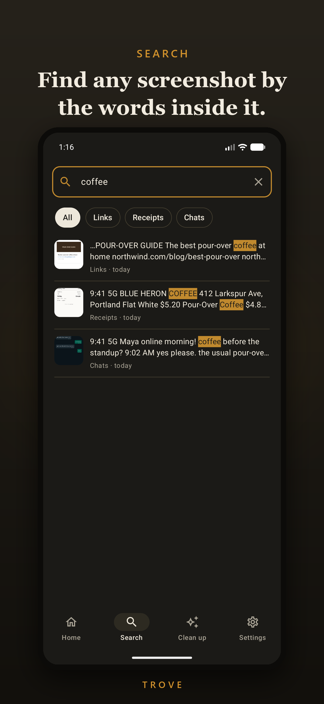
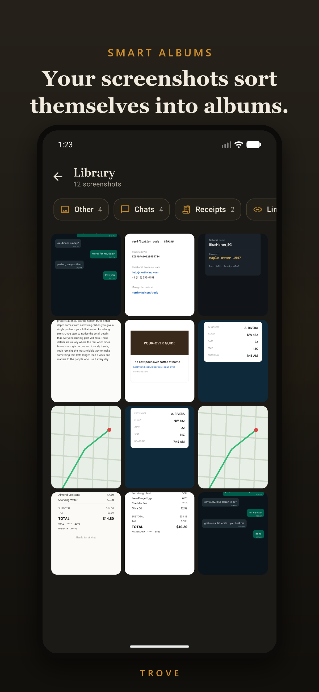
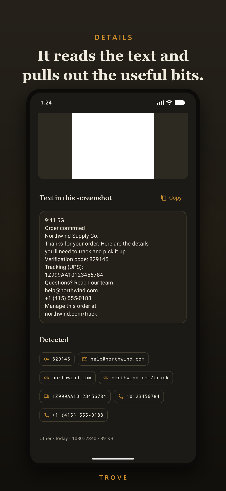
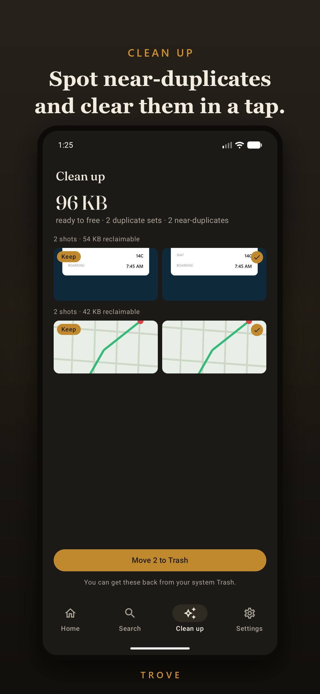
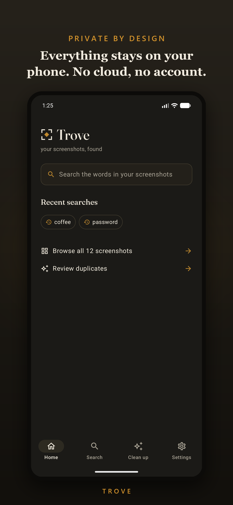

# Trove

**Find any screenshot by the words inside it.**

You take a screenshot of a recipe, a confirmation number, a Wi-Fi password, a
half-read article, and then it vanishes into a pile of thousands. Trove reads the
text in every screenshot, right on your phone, so you can just type what you
remember and get it back.

No account. No cloud. No network at all. Trove has no internet permission, so
your screenshots and everything Trove reads from them stay on your device,
full stop.

## What it does

- **Search the words inside your screenshots.** On-device OCR turns every shot
  into searchable text. Type "boarding pass" or part of an address and it's there.
- **Pulls out the useful bits.** Links, emails, phone numbers, one-time codes,
  and tracking numbers are detected and ready to copy.
- **Sorts itself.** Receipts, chats, docs, QR codes, tickets, and maps get
  grouped into smart albums without you tagging anything.
- **Clears the clutter.** Trove spots near-duplicate shots and lets you clean
  them out in a couple of taps. Deletes go to your system Trash, so nothing is
  gone for good by accident.
- **Brings things back.** Pin the screenshots you keep reaching for, and let
  "On this day" resurface what you saved a year ago.

Trove is built to stay quick even with thousands of screenshots. Your library is
browsable in seconds, and the heavier text-reading happens quietly in the
background while the app is open (or only while charging, if you prefer).

## Screenshots

<p align="center">
  
  
  
  
  
</p>

## Privacy

Everything stays on your device. Trove has no internet permission, so it cannot
send your screenshots or their text anywhere. See [PRIVACY.md](PRIVACY.md) for
the details.

## Tech

Kotlin, Jetpack Compose, Material 3, Room (FTS), WorkManager, Coil, and
PaddleOCR PP-OCRv5 models on ONNX Runtime for the OCR. minSdk 26, 64-bit only
(arm64-v8a / x86_64). See
[docs/ARCHITECTURE.md](docs/ARCHITECTURE.md) for how the code is organized.

## Building

Open the folder in Android Studio (it uses the Gradle wrapper), or from the
command line:

```
./gradlew assembleDebug
```

The SDK location is read from `local.properties` (`sdk.dir`).

## Contributing

Trove isn't open to outside contributions just yet, so issues and pull requests
are closed for now. That may change down the line. You're welcome to fork it
under the license in the meantime.

## License

[Apache 2.0](LICENSE). Use it, fork it, build on it.
